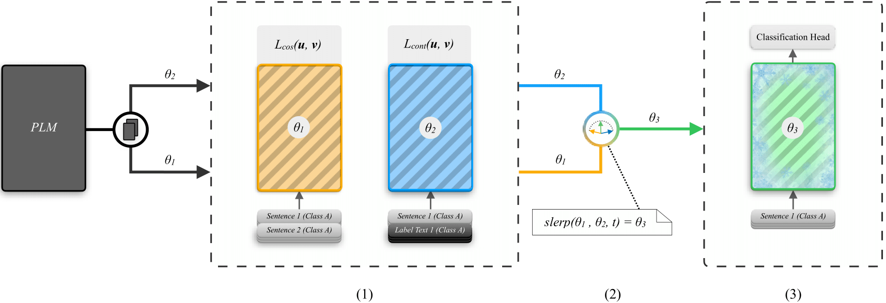

# FusionSent: A Fusion-Based Multi-Task Sentence Embedding Model

Welcome to the FusionSent repository. FusionSent is an efficient few-shot learning model designed for multi-label classification of scientific documents with many classes. 



**Figure 1**: The training process of FusionSent comprises three steps:

1. Fine-tune two different sentence embedding models from the same Pre-trained Language Model (PLM), with parameters θ₁, θ₂ respectively. 
   - θ₁ is fine-tuned on pairs of training sentences using cosine similarity loss, and θ₂ is fine-tuned on pairs of training sentences and their corresponding label texts, using contrastive loss.
   - Label texts can consist of simple label/class names or more extensive texts that semantically describe the meaning of a label/class.
2. Merge parameter sets θ₁, θ₂ into θ₃ using Spherical Linear Interpolation (SLERP).
3. Freeze θ₃ to embed the training sentences, which are then used as input features to train a classification head.

By fine-tuning sentence embedding models using contrastive learning, FusionSent achieves high performance even with limited labeled data. The model initially leverages two distinct sub-models: one, using regular contrastive learning with item pairs (['setfit'](https://github.com/huggingface/setfit)), and another using label embeddings with class-description pairs ('label_embedding'). These two models are then fused, via (spherical) linear intterpolation, to create the robost FusionSent model that excels in diverse classification tasks. For detailed insights into the model and its performance, please refer to our [published paper](#).

## Overview

`FusionSent` is integrated with the [Hugging Face Hub](https://huggingface.co/) and provides two main classes:

- **FusionSentModel**: This class encapsulates the dual fine-tuning process of the two sentence embedding models ('setfit, and 'label_embedding') and their fusion into a single model ('fusionsent'). It is the core model class for embedding sentences and performing classification tasks.
- **FusionTrainer**: Responsible for loading, cleaning, and preparing datasets for training and evaluation.

## Installation

To install the `fusionSent` package, use pip:

```bash
pip install fusionsent
```

## Usage Example

```python
from fusionsent.training_args import TrainingArguments
from fusionsent.modeling import FusionSentModel
from fusionsent.trainer import Trainer
from datasets import Dataset

# Example dataset objects with sentences belonging to classes: ["Computer Science", "Physics", "Philosophy"]
train_dataset = Dataset.from_dict({
    "text": [
        "Algorithms and data structures form the foundation of computer science.",
        "Quantum mechanics explores the behavior of particles at subatomic scales.",
        "The study of ethics is central to philosophical inquiry."
    ],
    "label": [
        [1, 0, 0],  # Computer Science
        [0, 1, 0],  # Physics
        [0, 0, 1]   # Philosophy
    ],
    "label_description": [
        ["Computer Science"],
        ["Physics"],
        ["Philosophy"]
    ]
})

eval_dataset = Dataset.from_dict({
    "text": [
        "Artificial intelligence is transforming the landscape of technology.",
        "General relativity revolutionized our understanding of gravity.",
        "Epistemology questions the nature and limits of human knowledge."
    ],
    "label": [
        [1, 0, 0],  # Computer Science
        [0, 1, 0],  # Physics
        [0, 0, 1]   # Philosophy
    ],
    "label_description": [
        ["Computer Science"],
        ["Physics"],
        ["Philosophy"]
    ]
})

# Load the model.
model_id = "malteos/scincl"
model = FusionSentModel._from_pretrained(model_id=model_id)

# Set training arguments.
training_args = TrainingArguments(
    batch_sizes=(16, 1),
    num_epochs=(1, 3),
    sampling_strategies="undersampling"
)

# Initialize trainer.
trainer = Trainer(
    model=model,
    args=training_args,
    train_dataset=train_dataset,
    eval_dataset=eval_dataset
)

# Train the model.
trainer.train()

# Evaluate the model.
eval_scores = trainer.evaluate(
    x_eval=eval_dataset["text"],
    y_eval=eval_dataset["label"]
)

# Perform inference.
texts = [
    "Computational complexity helps us understand the efficiency of algorithms.",
    "Thermodynamics studies the relationships between heat, work, and energy.",
    "Existentialism explores the freedom and responsibility of individual existence."
]
predictions = model.predict(texts)
print(predictions)
```

For a more elaborate example, please refer to the [Jupyter notebook of a Description-Embedding Experiment](./Evaluate_Description-Embedding_Body.ipynb).

## Citation

If you use FusionSent in your research, please cite the following paper:

```bibtex
@article{...,
  title={...},
  author={...},
  journal={...},
  year={...}
}
```

For additional details and advanced configurations, please refer to the original paper linked at the beginning of this document.